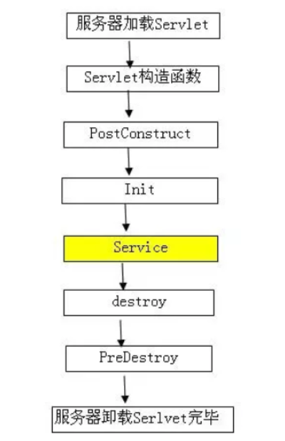

# 反射

```java
首先 Class c = ArrayList.class;
```


## 判断变量是否为基础数据类型

```java
c.isPrimitive()
```


## 判断c是否是List类的父类

```java
c.isAssignableFrom(List.class)
```


## 判断c是否是List类的子类

```java
c isinstanceof List
```


## 获取包含泛型类型的类型以及泛型真正的类型

```java
Map<String,Integer> map = new HashMap<String,Integer>();
Field f = c.getDeclaredField("map");
// 获取包含泛型的类型
Type t = f.getGenericType();
/**
  * Type这个类里面没有任何的方法，所以需要调用子类的方法，那么大的类型转到小的类型，需要强转！
*/
ParameterizedType pt = (ParameterizedType)t;//强转到其子类
/**
 *  Type[] getActualTypeArguments()
    返回表示此类型实际类型参数的 Type对象的数组。
    Type getOwnerType()
    返回 Type 对象，表示此类型是其成员之一的类型。
    Type getRawType()
    返回 Type 对象，表示声明此类型的类或接口。
*/
t = pt.getRawType();//类型的类或接口
// 获取泛型真正的类型
Type[] ts = pt.getActualTypeArguments();
```

# 关键字

## strictfp

<span style="font-weight:bold">strictfp，即strict float point（精确浮点）</span>

strictfp 关键字可应用于类、接口或方法。使用 strictfp 关键字声明一个方法时，该方法中所有的float和double表达式都严格遵守FP-strict的限制,符合IEEE-754规范。当对一个类或接口 使用 strictfp 关键字时，该类中的所有代码，包括嵌套类型中的初始设定值和代码，都将严格地进行计算。严格约束意味着所有表达式的结果都必须是 IEEE 754 算法对操作数预期的结果，以单精度和双精度格式表示。
　　如果你想让你的浮点运算更加精确，而且不会因为不同的硬件平台所执行的结果不一致的话，可以用关键字strictfp.

例子如下：

不使用strictfp：

```java
public class Test {
    private static double aDouble = 0.0555500333333212d;
    private static float aFloat = 0.0333000000222f;
    public static void main(String[] args) {
        double cDouble = aDouble / aFloat;
        System.out.println("aDouble: " + aDouble);
        System.out.println("aFloat: " + aFloat);
        System.out.println("cDouble: " + cDouble);
    }
}
```

使用strictfp：

```java
public strictfp class Test {
    private static double aDouble = 0.0555500333333212d;
    private static float aFloat = 0.0333000000222f;
    public static void main(String[] args) {
        double cDouble = aDouble / aFloat;
        System.out.println("aDouble: " + aDouble);
        System.out.println("aFloat: " + aFloat);
        System.out.println("cDouble: " + cDouble);
    }
}
```

结果：

不使用strictfp：

```java
aDouble:0.0555500333333212
aFloat:3.33000016E11
cDouble:1.6681690896577544E-13
```


使用strictfp：

```java
aDouble:0.0555500333333212
aFloat:0.0333
cDouble:1.668169110346482
```

# 权限控制

| 修饰词     | 本类 | 同一个包的类 | 继承类 | 其他类 |
| ---------- | ---- | ------------ | ------ | ------ |
| private    | 1    | 0            | 0      | 0      |
| 无（默认） | 1    | 1            | 0      | 0      |
| protected  | 1    | 1            | 1      | 0      |
| public     | 1    | 1            | 1      | 1      |

# 注解

## @PostConstruct与@PreDestory

从Java EE 5规范开始，Servlet中增加了两个影响Servlet生命周期的注解（Annotation）：

@PostConstruct和@PreDestory

这两个注解被用来修饰一个非静态的void()方法，而且这个方法不能有抛出异常声明。写法有如下两种方式：

```java
@PostConstruct
public void someMethod(){}
```

或者

```java
public @PostConstruct void someMethod(){}
```

被@PostConstruct修饰的方法会在服务器加载Servlet的时候运行，并且只会被服务器执行一次。@PostConstruct修饰的方法在构造函数之后执行，在init()方法之前执行。@PreDestory修饰的方法在destroy()方法执行之后执行，在Servlet被彻底卸载之前执行。



使用场景：

在servlet初始化加载之前可能会需要处理一些东西，像加载缓存，加载线程池等，此时@PostConstruct就能派上用场了，当然，也可以不使用该注解，如果我们要加载或处理某些东西，我们完全可以在构造器初始化的时候就直接处理掉，只不过这种方法需要自己重写构造器。


另外，spring中Constructor、@Autowired、@PostConstruct的顺序

其实从依赖注入的字面意思就可以知道，要将对象p注入到对象a，那么首先就必须得生成对象a和对象p，才能执行注入。所以，如果一个类A中有个成员变量p被@Autowried注解，那么 **@Autowired注入是发生在A的构造方法执行完之后的**。

如果想在生成对象时完成某些初始化操作，而偏偏这些初始化操作又依赖于依赖注入，那么久无法在构造函数中实现。为此，可以使用@PostConstruct注解一个方法来完成初始化，**@PostConstruct注解的方法将会在依赖注入完成后被自动调用**。

Constructor >> @Autowired >> @PostConstruct

举例： 

```java
public class AAA{
    @Autowired
    private BBB b;
    
    public AAA(){
        System.out.println("此时b还未被注入：b = " + b);
    }
    
    @PostConstruct
    private void init(){
        System.out.println("@PostConstruct将在依赖注入完成之后被自动调用：b = " + b);
    }
}
```


# 生成随机值

## UUID包的使用

```java
UUID.randomUUID();
```

