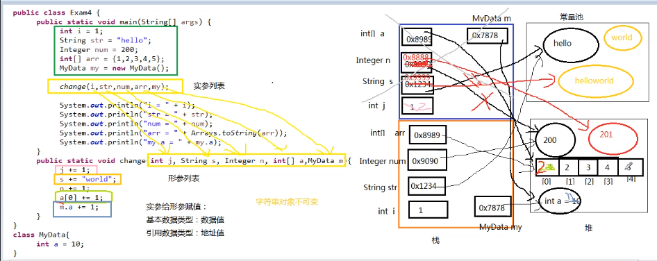
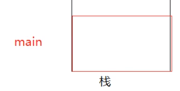
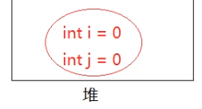
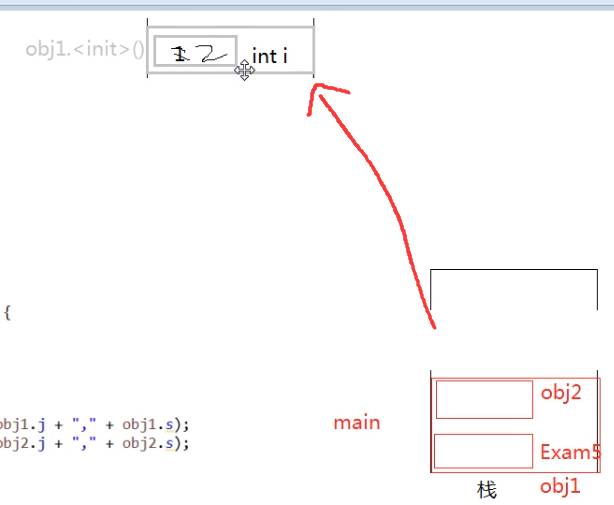

# 自增、计算与赋值（相关：《JVM虚拟机规范》关于指令的部分）

```java
public static void main(String[] args) {
    int i = 1;
    i = i++;
    int j = i++;
    int k = i + ++i * i++;
    System.out.println("i=" + i); // 4 
    System.out.println("j=" + j); // 1
    System.out.println("k=" + k); // 11
}
```

解释 i = i ++;

对于int i会有一个局部变量表和一个操作数栈

执行i = i ++；的时候的操作顺序：

1、把i的值压入操作数栈（操作数栈中i为1）

2、i变量自增1（局部变量表中i为1+1=2）

3、把操作数栈中的值赋值给i（局部变量表中的2被覆盖变成1）

因此i = i ++最后i还是1


解释k = i + ++i * i++;

首先i这个时候是2

| 步骤 | 局部变量表（存的int i） | 操作数栈 | 说明                                      |
| ---- | ----------------------- | -------- | ----------------------------------------- |
| 1    | 2                       | 2        |                                           |
| 2    | 3                       | 2，3     | ++i的时候先将i自增1变成3再将3压入操作数栈 |
| 3    | 4                       | 2，3，3  | i++先将i压入操作数栈，后执行自增1         |

依次出栈后k即为：2 + 3 * 3 = 11

# 单例

- 某个类只能有一个实例
  - 构造器私有化
- 它必须自行创建这个实例
  - 含有一个该类的静态变量来保存这个唯一的实例
- 它必须自行向整个系统提供这个实例
  - 对外提供获取该实例对象的方式
    - 直接暴露
    - 用静态变量的get方法获取

实现方式：

- 饿汉式

  直接创建对象，不存在线程安全问题

  ```java
  /*
  * 饿汉式：
  *   在类初始化时直接创建实例对象，不管是否需要这个对象都会创建
  */
  ```

  

  - 直接实例化饿汉式（简洁直观）

    ```java
    /*
    *   （1）构造器私有化
    *   （2）自行创建，并且用静态变量保存
    *   （3）向外提供者个实例
    *   （4）强调这是一个单例，可以用final修饰
    * */
    public class Singleton {
        // 因为是静态方法，因此在类被加载的时候就会创建
        public static final Singleton1 INSTANCE = new Singleton();
        private Singleton(){}
    }
    
    ```

  - 枚举式（最简洁）

    ```java
    /*
    * 枚举类型（枚举类型构造器全部都是私有的），表示该类型的对象是有限的几个
    * 我们可以限定为一个，就成了单例
    * */
    public enum Singleton {
        INSTANCE
    }
    ```

    

  - 静态代码块饿汉式（适合复杂实例化）

    ```java
    // 这么写跟上面的直接实例化没什么区别
    public class Singleton{
        public static final Singleton INSTANCE;
        static {
            INSTANCE = new Singleton();
        }
        private Singleton(){}
    }
    
    // 使用静态代码块的写法多用于需要使用配置文件中信息的情况
    public class Singleton{
        public static final Singleton INSTANCE;
        private String info;
        static {
            Properties pro = new Properties();
            try {
                // 要想读取外部配置文件需要先获取类构造器，Singleton正好有一个类构造器，那直接用Singleton的即可
                pro.load(Singleton.class.getClassLoader().getResourceAsStream("single.properties"));
                INSTANCE = new Singleton(pro.getProperty("info"));
            } catch (IOException e) {
                throw new RuntimeException(e)
            }
        }
        private Singleton(String info){
            this.info = info;
        }
    }
    ```

    

- 懒汉式

  延迟创建对象

  ```java
  /*
  * 懒汉式：
  *   延迟创建这个实例对象
  */
  ```

  

  - 线程不安全（适用于单线程）

    ```java
    /*
    *   （1）构造器私有化
    *   （2）用一个静态变量保存这个唯一的实例
    *   （3）提供一个静态方法，获取这个实例对象
    * */
    public class Singleton{
        private static Singleton instance;
        private Singleton(){}
        public static Singleton getInstance(){
            if (instance == null){
                instance = new Singleton();
            }
            return instance;
        }
    }
    ```

    此时如果存在多线程，并且我们给Singleton加一个Thread.sleep()：

    ```java
    public class Singleton{
        private static Singleton instance;
        private Singleton(){}
        public static Singleton getInstance(){
            if (instance == null){
                try {
                    Thread.sleep(100);
                } catch (InterruptedException e) {
                    e.printStackTrace();
                }
                instance = new Singleton();
            }
            return instance;
        }
    }
    
    public class MyTest{
        Callable<Singleton> c = new Callable<Singleton>() {
            @Override
            public Singleton call() throws Exception {
                return Singleton.getInstance();
            }
        };
        ExecutorService es = Executors.newFixedThreadPool(2);
        Future<Singleton> f1 = es.submit(c);
        Future<Singleton> f2 = es.submit(c);
    
        Singleton s1 = f1.get();
        Singleton s2 = f2.get();
        es.shutdown();
    }
    ```

    我们发现它存在线程安全问题

    

  - 线程安全（适用于多线程）

    对于上述问题我们只需给它加一个synchronized并锁住类对象就行了

    ```java
    public class Singleton{
        private static Singleton instance;
        private Singleton(){}
        public static Singleton getInstance(){
            synchronized (Singleton.class){
                if (instance == null){
                    try {
                        Thread.sleep(100);
                    } catch (InterruptedException e) {
                        e.printStackTrace();
                    }
                    instance = new Singleton();
                }
            }
            return instance;
        }
    }
    ```

    此时存在一个待优化问题：如果这个Thread.sleep()大一点，那后面的所有线程都需要等待很长时间，但我们的目的是让他保持单例，而不是每个线程执行一遍代码逻辑，所以这个时候可以在最外面再套一层if判断逻辑，如果实例已经存在那就不要再等了，直接返回：

    ```java
    public class Singleton{
        private static Singleton instance;
        private Singleton(){}
        public static Singleton getInstance(){
            if (instance == null) {
                synchronized (Singleton.class) {
                    if (instance == null) {
                        try {
                            Thread.sleep(100);
                        } catch (InterruptedException e) {
                            e.printStackTrace();
                        }
                        instance = new Singleton();
                    }
                }
            }
            return instance;
        }
    }
    ```

    

  - 静态内部类形式（适用于多线程）

    比起上面，我们可以用更简便的方式：利用类加载器的特性（线程安全，用到的时候单独加载和初始化）编写静态内部类的形式来创建懒汉式单例：

    ```java
    /*
    * 在内部类被加载和初始化时，才创建INSTANCE实例对象
    * 静态内部类不会自动随着外部类的加载和初始化而初始化，它是要单独去加载和初始化的
    * 因为是在内部类加载和初始化时创建的，因此是线程安全的
    * */
    public class Singleton{
        private Singleton(){}
        private static class Inner{
            private static final Singleton INSTANCE = new Singleton();
        }
        public static Singleton getInstance() {
            return Inner.INSTANCE;
        }
    }
    ```

    

# 类初始化过程（相关：《JVM虚拟机规范》中关于\<clinit\>和\<init\>方法的说明、invokespecial指令）

假设有父类：

```java
/*
* 父类的初始化<clinit>:
*   (1) j = method();
*   (2)父类的静态代码块
*
* 父类的实例化方法：
*   (1)super()（最前）
*   (2)i = test();
*   (3)父类的非静态代码块
*   (4)父类的无参构造（最后）
*
* 非静态方法前面其实有一个默认的对象this
* this在构造器（或<init>)中表示的是正在创建的对象，因为这里是在创建Son对象，所以test()执行的是子类重写的代码（面向对象多态）
* 因此这里i = test()执行的是子类重写的test()方法
* */
public class Father{
    private int i = test();
    private static int j = method();
    static {
        System.out.println("(1)");
    }
    Father(){
        System.out.println("(2)");
    }
    {
        System.out.println("(3)");
    }
    public int test() {
        System.out.println("(4)");
        return 1;
    }
    public static int method() {
        System.out.print("(5)");
        return 1;
    }
}
```

有子类：

```java
/*
* 子类的初始化<clinit>
*   (1) j = method()
*   (2)子类的静态代码块
*
* 先初始化父类:(5)(1)
* 再初始化子类:(10)(6)
*
* 子类的实例化方法：
*   （1）super()（最前） (9)(3)(2) ，这里为什么是子类的(9)而不是父类的(4)呢？那是因为发生了重写，<init>方法中this表示正在创建的对象，而它正是Son，因此执行的是Son的test()方法，所以输出(9)
*   （2）i = test(); (9)
*   （3）子类的非静态代码块 (8)
*   （4）子类的无参构造（最后） (7)
*
* 因为创建了两个Son对象，因此实例化方法<init>执行了两次，所以又会输出一次(9)(3)(2)(9)(8)(7)
* */
public class Son extends Father{
    private int i = test();
    private static int j = method();
    static {
        System.out.println("(6)");
    }
    Son(){
//        super(); 写或不写都在，在子类构造器中一定会调用父类的构造器
        System.out.println("(7)");
    }
    {
        System.out.println("(8)");
    }
    public int test() {
        System.out.println("(9)");
        return 1;
    }
    public static int method() {
        System.out.print("(10)");
        return 1;
    }

    public static void main(String[] args) {
        Son s1 = new Son();
        System.out.println();
        Son s2 = new Son();
    }
}
```

执行Son类后输出顺序：

```java
(5)(1)(10)(6)(9)(3)(2)(9)(8)(7)
(9)(3)(2)(9)(8)(7)
```

解释：

该问题包括一下三个考点：

- 类初始化过程

  - 一个类要创建实例需要先加载并初始化该类
    - main方法所在的类需要先加载和初始化（Son中有main，所以就算没new Son()，Son类也会被初始化）

  - 一个子类要初始化需要先初始化父类
  - 类初始化的时候都会执行\<clinit\>()方法，可以在编译后的.class文件中看到
    - \<clinit\>()方法由静态类变量显示赋值代码和静态代码块组成
    - 类变量显示赋值代码和静态代码块代码从上到下顺序执行，也就是谁先写谁先执行
    - \<clinit\>()方法只执行一次

- 实例初始化过程

  - 实例初始化就是执行\<init\>()方法
    - \<init\>()方法可能重载有多个，有几个构造器就有几个\<init\>方法
    - \<init\>()方法由非静态实例变量显示赋值代码和非静态代码块、对应构造器代码组成
    - 非静态实例变量显示赋值代码和非静态代码块代码从上到下顺序执行，而对应<font color="red">构造器的代码最后执行</font>
    - 每次创建实例对象，调用对应构造器，执行的就是对应的\<init\>方法
    - \<init\>方法的首行是super()或super(实参列表)，即对应父类的\<init\>方法（在子类构造器中不管有没有手动写都一定会有一句super()来调用父类的构造器）

- 方法的重写

  - 哪些方法不可以被重写
    - final方法
    - 静态方法
    - private等子类中不可见方法
  - 对象的多态性
    - 子类如果重写了父类的方法，通过子类对象调用的一定是子类重写过的代码
    - 非静态方法默认的调用对象是this
    - this对象在构造器或者说\<init\>方法中就是正在创建的对象

- override和overload的区别

  overload是重载的意思，它指我们可以定义若干名称相同的方法，通过传入不同的参数来选择合适的方法执行

  override是覆盖的意思，也就是重写，它是覆盖了一个方法并对其重写，以求达到不同的作用。重写表示子类中的方法可以与父类（或接口）中的某个方法的名称和参数完全相同

- invokespecial指令

  主要目的：得到对象存在堆中的地址，这样就可以用当前类、父类、父父类，即继承层的所有对象，把继承层的所有对象的数据和方法为自己当前对象使用。上面说的\<init\>方法的执行就要依据字节码中是否包含invokespecial指令

# 参数传递机制

有代码如下：

```java
public class Test{
    public static void main(String[] args) {
        int i = 1;
        String str = "hello";
        Integer num = 200;
        int[] arr = {1, 2, 3, 4, 5};
        MyData my = new MyData();

        change(i, str, num, arr, my);

        System.out.println("i = " + i);
        System.out.println("str = " + str);
        System.out.println("num = " + num);
        System.out.println("arr = " + Arrays.toString(arr));
        System.out.println("my.a = " + my.a);
    }
    public static void change(int j, String s, Integer n, int[] a, MyData m){
        j += 1;
        s += "world";
        n += 1;
        a[0] += 1;
        m.a += 1;
    }
}

class MyData {
    int a = 10;
}
```

输出结果：

```java
i = 1
str = "hello"
num = 200
arr = [2, 2, 3, 4, 5]
my.a = 11
```


考点：

- 方法的参数传递机制
  - 形参如果是<font color="red">基本数据类型</font>那就<font color="red">传递数据值</font>
  - 形参如果是<font color="red">引用数据类型</font>那就<font color="red">传递地址值</font>
    - 特殊的类型：String、包装类等对象不可变性
- String、包装类等对象的不可变性



注意，对于局部变量，他可能是实参也有可能是形参，因此栈中对于局部变量会有两种划分，一种为实参列表（上图蓝色框框）一种为形参列表（上图橙色框框）

过程分析：

- 首先在实参列表中：

  | 参数          | 保存形式 | 值   | 指向                | 说明                                                         |
  | ------------- | -------- | ---- | ------------------- | ------------------------------------------------------------ |
  | int i         | 值       | 1    |                     | 因为不是对象，所以直接保存数值                               |
  | String str    | 地址     |      | 常量池字符串”hello“ | 首先”hello“字符串是保存在常量池中的。因为str是对象，所以栈中保存引用地址并指向常量池中的字符串”hello“ |
  | Integer num   | 地址     |      | 堆中的200           | 首先200这个数值它不是保存在常量池中的而是保存到堆中。因为num是包装类，所以栈中保存引用地址并指向堆中的200 |
  | int[] arr     | 地址     |      | 堆中对应的数组      | 由于是数组，因此栈中保存引用地址并指向堆中数组               |
  | MyData myData | 地址     |      | 堆中的对象          | 由于是对象，因此栈中保存引用地址并指向堆中对象               |

  

- 然后在形参列表中：

  | 参数      | 保存形式 | 值   | 指向                | 说明                                        |
  | --------- | -------- | ---- | ------------------- | ------------------------------------------- |
  | int j     | 值       | 1    |                     | 因为不是对象，所以直接保存数值              |
  | String s  | 地址     |      | 常量池字符串”hello“ | 因为传参过来的是地址，所以指向同一个“hello” |
  | Integer n | 地址     |      | 堆中的200           | 同上                                        |
  | int[] a   | 地址     |      | 堆中对应的数组      | 同上                                        |
  | MyData m  | 地址     |      | 堆中的对象          | 同上                                        |


- 现在开始执行change()方法
  - j += 1，只是形参j加了1，跟实参i没关系
  - s += "world"，跟”hello“一样，常量池中会有”world“，然后执行字符串拼串变成”helloworld“，”helloworld“也在常量池中，然后形参s在栈中的地址改变并指向常量池”helloworld“，由于形参实参的地址都不一样了，因此形参s确实改变了，但对实参str没有半毛钱关系，所以实参str还是指向”hello“。这也是String对象的不可变性
  - n += 1，同String，它会在堆中新建一个201，并改变形参的地址指向201，而实参仍旧是指向堆中的200.这是包装类对象的不可变性
  - a[0] += 1，拿到的是arr的地址，直接操作arr数组本身，因此形参变了实参也得变
  - m.a += 1，同arr，拿到的是myData对象地址，直接操作对象本身，因此形参变了实参也得变

- change()方法执行完毕，所有形参全部销毁

# 就近原则、变量分类、非静态代码块的执行、方法的调用规则

代码如下：

```java
public class Exam5 {
    static int s; // 成员变量，类变量
    int i; // 成员变量，实例变量
    int j; // 成员变量，实例变量
    {
        int i = 1; // 非静态变量代码块中的局部变量i
        i++;
        j++;
        s++;
    }
    public void test(int j) { // 形参，局部变量j
        j++;
        i++;
        s++;
    }

    public static void main(String[] args) {
        Exam5 obj1 = new Exam5(); // 局部变量t1
        Exam5 obj2 = new Exam5(); // 局部变量t2
        obj1.test(10);
        obj1.test(20);
        obj2.test(30);
        System.out.println(obj1.i + ", " + obj1.j + ", " + obj1.s);
        System.out.println(obj2.i + ", " + obj2.j + ", " + obj2.s);
    }
}
```

输出结果：

```java
2,1,5
1,1,5
```

分析：

最开始会在栈中给主方法分配一块空间：



执行第一句：

```java
Exam5 obj1 = new Exam5();
```

首先方法区中会有一块区域：Exam5.class，静态变量s会被放进去并且初始化为0：


堆中会生成一个对象，并且会有实例变量i和j，都初始化为0：



栈中会压入一个变量叫obj1，并指向堆中的那个对象

<span style="color: red">现在还剩一个非静态代码块，非静态代码块中的变量是在实例化的过程中进行分配的，而实例化其实执行的就是\<init\>()方法，因此将该方法压入栈，并在方法内部初始化局部变量i：</span>


之后在{}内部遇到i++，上图的i就变成2，遇到j++，{}内部没有变量j，往{}外面找，找到了堆中的实例中的j，此时执行j++，j变成1，遇到s++，将方法区中的s变为1

此时实例obj1已经实例化完成，\<init\>()方法出栈，并且\<init\>()方法中的局部变量i也被销毁：




执行：

```java 
obj1.test(10)
```

test方法需要入栈，并且在方法内部有个局部变量j，将其初始化为10：


执行j++，test方法中的局部变量j变为11，执行i++，test方法中找不到局部变量i，往外找，找到堆中实例，并将实例中的成员变量i+1，i变为1，执行s++，方法区中的s变为2

此时方法执行完毕，test方法出栈，test方法中的变量j销毁

执行：

```java
obj1.test(20)
```

过程跟上一步差不多，结果就是test中j变为21，堆中成员变量i变为2，方法区中s变为3，然后test方法出栈，test中局部变量j销毁

执行：

```java
Exam5 obj2 = new Exam5();
```

跟上面执行过程一样，结果就是堆中新开辟一个实例，该实例成员变量i和j都初始化为0，\<init\>()方法先进栈，初始化局部变量i为1，遇到{}内i++，i变为2，遇到j++，实例成员变量j变1，遇到s++，方法区s+1变为4，\<init\>()方法执行完毕出栈，局部变量i销毁

执行：

```java
obj2.test(30)
```

跟上面一样，test方法先进栈并初始化局部变量j为30，j++，j变为31，i++，找不到局部变量i，去外面找，找到实例成员变量i，i变1，s++，方法区s变为5，test方法执行完毕，出栈，局部变量j销毁

所以最后第一个实例的i，j，s为：2，1，5；第二个实例的i，j，s为：1，1，5

考点：

- 就近原则

  从附近开始找，找不到再去父亲那边找，父亲那边如果还是找不到，那就再往上找。

  所以这种情况肯定是访问{}中的变量i：

  ```java
  public class Test {
      int i;
      {
          int i = 1;
          i++;
      }
  }
  ```

  但是如果是这种情况访问的就是{}外的成员变量i了：

  ```java
  public class Test {
      int i;
      {
          int i = 1;
          // i前面加了this.
          this.i++;
      }
  }
  ```

  

- 变量的分类

  - 成员变量：类变量、实例变量
  - 局部变量

  <span style="font-weight: bold">局部变量与成员变量的区别：</span>

  声明的位置：

  - 局部变量：方法体{}中，形参，代码块{}中
  - 成员变量：类中方法外
    - 类变量：有static修饰
    - 实例变量：没有static修饰

  修饰符:

  - 局部变量：final
  - 成员变量：public、protected、private、final、static、volatile、transient

  <font color="red">值存储的位置：</font>

  - 局部变量：栈（Stack，是指虚拟机栈。虚拟机栈用于存储局部变量表等。局部变量表存放了编译期可知长度的各种基本数据类型（boolean、byte、char、short、int、float、long、double）、对象引用（reference类型，它不等同于对象本身，是对象在堆内存的首地址）。方法执行完，自动释放。）
  - 实例变量：堆（Heap，此内存区域的唯一目的就是存放对象实例，几乎所有的对象实例都在这里分配内存。这一点在Java虚拟机规范中的描述是：所有的对象实例以及数组都要在堆上分配。）
  - 类变量：方法区（Method Area，用于存储已被虚拟机加载的类信息、常量、静态变量、即时编译器编译后的代码等数据。）

  作用域：

  - 局部变量：从声明处开始，到所属的}结束
  - 实例变量：在当前类中“this.”（有时this.可以缺省），在其他类中“对象名.”访问
  - 类变量：在当前类中“类名.”（有时类名.可以省略），在其他类中“类名.”或“对象名.”访问

  生命周期：

  - 局部变量：每一个线程，每一次调用执行都是新的生命周期
  - 实例变量：随着对象的创建而初始化，随着对象的被回收而消亡，每一个对象的实例变量是独立的
  - 类变量：随着类的初始化而初始化，随着类的卸载而消亡，该类的所有对象的类变量是共享的

  <font color="red">当局部变量与xx变量重名时，如何区分：</font>

  - 局部变量与实例变量重名
    - 在实例变量前面加“this.”

  - 局部变量与类变量重名
    - 在类变量前面加“类名.”

- 非静态代码块的执行：每次创建实例对象都会执行

- 方法的调用规则：调用一次执行一次

